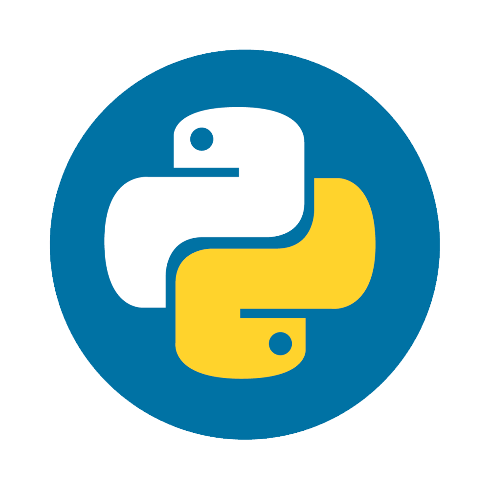

# Hi, I'm Vitaly () 

> <em> 
I specialize in the Frontend area, I know how to use GitHub, write clean and understandable code, and push it punctually and responsibly.
At the moment I am studying new technologies, improving the learned skills and starting to think about an internship
The main professional interest is development, I would like to get deeper knowledge and experience in working with large projects, and then apply them in a team</em>

### Languages and Tools:

 <!--yeah postgres with one 'S'! -->

 

### Last books read by me :
1. Code: The Hidden Language of Computer Hardware and Software
<!--   -->
2. The Goal. Novel by Eliyahu M. Goldratt
<!--   -->
3. Clean Code. Book by Robert Cecil
<!--   -->
4. Will: The Sunday Times Bestselling Autobiography. Will Smith

### Connect with me:

<!-- 

&nbsp;&nbsp; -->
[@swagv](https://t.me/swagv)
